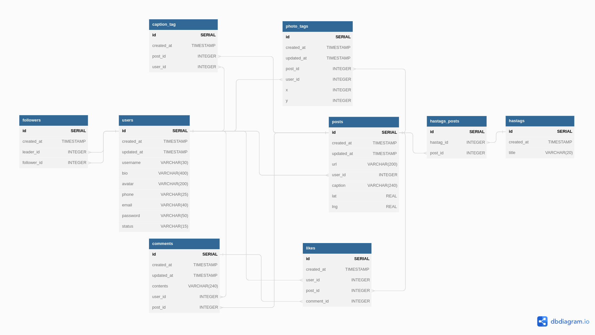

<h1 align="center"> Database Design For A Photo-Sharing Application </h1>

This is a database design project for a photo-sharing application like [Instagram](https://www.instagram.com/). The goal of this project is to create a robust and scalable database schema that can support the core features of a photo-sharing application, including user accounts, photo uploads, comments, likes, tags and hashtags.

## Schema Overview

The database schema is designed using a relational database model, and it consists of several interconnected tables, including:

- *Users*: This table stores information about registered users, including their `username`s, `phone` numbers, `email`s, `password`s and others.
- *Photos*: This table stores information about uploaded photos, including the photo ID, the user who uploaded it, the date it was uploaded, caption and where it was taken.
- *Comments*: This table stores information about comments on photos, including the comment ID, the user who made the comment, the photo it is associated with, its content and the date it was made.
- *Likes*: This table stores information about likes on photos and comments, including the user who made the like, the photo or comment it is associated with, and the date it was made.
- *Tags*: There're two tables associated with tags, `photo_tags` and `caption_tags`.
- *Hashtags*: The purpose of the hashtags table is to store information related to the hashtags used in posts. To establish a relationship between the hashtags and posts tables, a separate hashtags_posts table has been created to serve as a model for this association.
- *Followers*: This table stores information about the followers of a particular user. Each record in the followers table consists of a follower ID, a leader ID, and the timestamp of when the following occurred.

Below is a detailed diagram that showcases the database design:

The diagram has been created using dbdiagram special syntax, which can be found in the dbdiagram.md file or [here](https://dbdiagram.io/d/641309ff296d97641d8879af).

## Implementation

The database schema is implemented using the PostgreSQL relational database management system.

<!-- TODO: ## Design Considerations and Rationale -->

